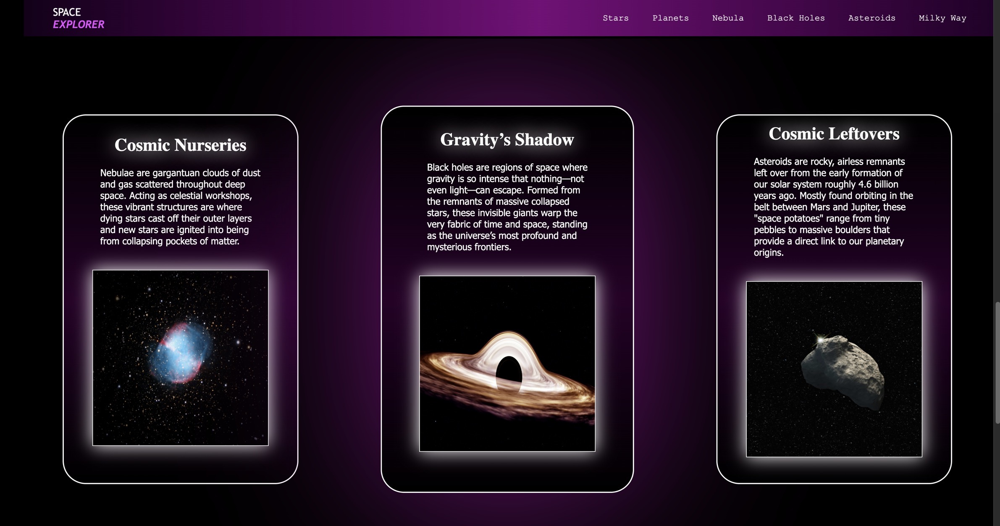

# 🌌 Space Explorer (May 4th - 7th 2026)

A cinematic space-themed landing page built with HTML and CSS.

This project was created about two weeks into learning frontend development as a way to strengthen my understanding of layout, styling, and modern website structure before moving deeper into backend development.

What started as a simple practice page quickly evolved into one of my first true frontend projects — featuring a video hero section, flexbox layouts, interactive cards, gradients, hover effects, and themed content sections inspired by astronomy and deep space exploration.

Instead of following a step-by-step tutorial, I designed and structured the site myself while learning through experimentation, debugging, and iteration.

---

## 🚀 Live Demo

https://davi-sousa-queiroz.github.io/Space-Explorer/

---

## 🧠 What I Practiced

- Flexbox layouts
- Hero sections with video backgrounds
- Navigation bars
- Content cards
- CSS positioning and layering
- Hover animations and transitions
- Background images and gradients
- Consistent visual design across sections
- Structuring larger frontend projects

---

## 🛠️ Technologies Used

- HTML5
- CSS3

---

## 📸 Preview

---

## 🌠 Project Highlights

### 🎥 Cinematic Hero Section
A fullscreen video hero with layered text, glowing effects, and a space-inspired visual theme.

### ☀️ Interactive Space Sections
Custom sections for stars, planets, nebulae, black holes, and asteroids using flexbox layouts and reusable card patterns.

### 🎨 Visual Consistency
Purple gradients, glowing shadows, hover effects, and typography were used throughout the site to create a unified aesthetic.

---

## 📈 What This Project Represents

This project represents a major step in my frontend journey.

Before this, most of my projects focused on Python fundamentals and backend concepts. Building this site helped me better understand how frontend and backend development connect together in real-world applications.

More importantly, it taught me how much can be learned by simply building ambitious projects and solving problems along the way.

---

## ⚠️ Notes

This project is not intended to be scientifically perfect or production-ready. It was built as a learning project focused on improving frontend development skills and design understanding.

---

## 💭 Future Improvements

- Improve responsiveness for mobile devices
- Add additional pages and navigation
- Refactor CSS into cleaner reusable sections
- Add smoother animations and transitions
- Improve accessibility and semantic structure

---

## 🧭 A Note to Future Me

A few weeks ago, HTML and CSS felt completely unfamiliar.

Now you're building cinematic landing pages with structured layouts, interactive sections, and real visual identity.

Keep stacking projects. Keep building. This is only the beginnin
